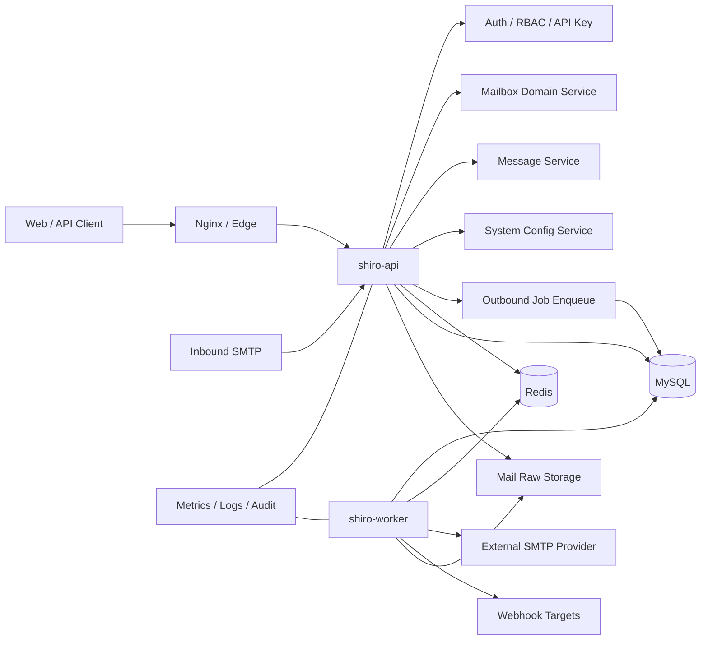

# ShiroMail 后端企业级成熟稳定改造方案

> 日期：2026-06-11  
> 范围：`backend/`、Docker Compose、后端运行配置与运维能力  
> 目标：在保留当前 Go/Gin/GORM/MySQL/Redis 架构的前提下，把后端从“可用产品”提升到“可长期公网运行、可观测、可恢复、可扩展”的企业级后端。

## 1. 总体结论

当前后端已经具备较完整的产品骨架：

- API、SMTP 入站、Worker、Webhook、系统配置、审计、监控、API Key、RBAC 等主要模块已经存在。
- 后端采用 repository/service/controller 分层，MySQL 与 Redis 均已接入，测试覆盖也不低。
- 用户提出的三个 issue 中，Redis 密码属于“部署一致性补齐”，永久邮箱属于“领域语义补强”，发送邮件属于“能力拆分后分阶段建设”。

但要达到企业级成熟稳定，当前最需要补齐的不是单点功能，而是以下七类能力：

1. 配置治理：启动前校验、敏感配置管理、运行时配置边界。
2. 数据治理：版本化迁移、迁移锁、可回滚策略、备份恢复。
3. 邮件可靠性：入站 SMTP 稳定性、出站投递队列、转发、DKIM/SPF/DMARC 策略。
4. 异步任务可靠性：Worker 调度、任务幂等、失败重试、死信与告警。
5. 安全基线：密钥保护、限流降级、鉴权策略、审计完整性。
6. 可观测性：结构化日志、指标标签、ready/live 探针、链路追踪。
7. 发布运维：服务拆分、健康检查、灰度发布、备份、灾备演练。

推荐路线：不要一次性重写。按 Phase 0 到 Phase 5 分阶段改造，每个阶段都能独立上线、独立验证。

## 2. 对用户 Issues 的合理性判断

### 2.1 支持发送邮件

合理，但必须拆成三种不同能力：

| 类型 | 当前状态 | 合理性 | 方案 |
|---|---|---|---|
| 系统通知邮件 | 已有 `mail.delivery`、测试发信、验证码邮件 | 已支持，需加固 | 增加队列、审计、重试、模板版本 |
| 邮箱转发 | `mailboxes.forward_to` 已存在，但 `SetForwardingCallback` 只是 TODO 日志 | 高优先级合理 | 先做入站邮件转发，复用 SMTP transport |
| 用户主动发信 | 当前没有 outbound 模型/API/队列 | 合理但风险更高 | 单独做 outbound 子系统，默认关闭，配额和风控先行 |

结论：先实现“系统通知可靠化 + 邮件转发”，不要直接开放用户任意发信。否则容易引入滥发、域名信誉、黑名单和合规风险。

### 2.2 支持永久邮箱

合理，而且当前属于半支持状态。

现状：

- `CreateMailboxRequest.Permanent` 已存在。
- `Mailbox.Permanent` 已存在。
- 创建永久邮箱时使用 `9999-12-31 23:59:59 UTC` 作为 `expires_at`。
- 但 `CountActive`、`ListActive`、`FindActiveByAddress`、`ListExpiredIDs` 仍主要依赖 `expires_at` 判断。

问题：业务语义不应依赖魔法时间。企业级改造应明确：`permanent = true` 才是永久邮箱的唯一业务标识，`expires_at` 只是兼容展示字段。

### 2.3 Redis 支持密码

合理，但后端代码已基本支持。

现状：

- `backend/internal/config/config.go` 已读取 `REDIS_PASSWORD`。
- `backend/internal/database/redis.go` 已传入 `redis.Options.Password`。
- Compose 中 Redis server 可配置 `--requirepass`。

缺口：

- `docker-compose.yml` 的 Redis healthcheck 仍使用无密码 `redis-cli ping`。
- `docker-compose.dev.yml` 没有与生产一致的可选密码模式。
- `config-check` 没有验证 Redis 密码部署契约。

结论：这是部署和校验问题，不需要重写 Redis 客户端。

## 3. 目标后端架构

目标架构不是换技术栈，而是把现有模块边界进一步固化：

核心原则：

- API 进程只处理同步请求、轻量校验、入站 SMTP 接收和任务入队。
- Worker 进程处理可重试异步任务：出站邮件、Webhook、清理、spool、统计刷新。
- MySQL 保存真实业务状态与任务状态；Redis 只做缓存、限流、短期 token、分布式锁。
- 运行时配置进入系统配置表，但敏感值应改为 secret ref 或加密存储。
- 每个后台能力必须具备：幂等键、重试策略、可观测指标、审计记录、管理员诊断入口。

## 4. 优先级路线图

### Phase 0：生产启动基线与配置治理

目标：让错误配置在启动前暴露，避免“带病上线”。

修改范围：

- `backend/internal/config/config.go`
- `backend/cmd/api/main.go`
- `backend/internal/bootstrap/app.go`
- `backend/internal/database/mysql.go`
- `backend/internal/database/redis.go`
- `docker-compose.yml`
- `docker-compose.dev.yml`
- `docker-compose.prod.yml`

设计要点：

1. 引入 `Config.Validate()`，按环境分级校验。
2. 生产环境必须校验：
   - `APP_ENV=production`
   - `JWT_SECRET` 长度与弱密钥黑名单
   - `MYSQL_DSN` 非默认 root/root
   - Redis 密码部署一致性
   - `CORS_ALLOWED_ORIGINS` 不允许 localhost
   - `METRICS_TOKEN` 必填或 metrics 默认关闭
3. 数据库连接池参数配置化：
   - `MYSQL_MAX_OPEN_CONNS`
   - `MYSQL_MAX_IDLE_CONNS`
   - `MYSQL_CONN_MAX_LIFETIME`
   - `MYSQL_CONN_MAX_IDLE_TIME`
4. Redis 连接池参数配置化：
   - `REDIS_POOL_SIZE`
   - `REDIS_MIN_IDLE_CONNS`
   - `REDIS_MAX_RETRIES`
   - `REDIS_DB`
5. Compose Redis healthcheck 支持有密码和无密码两种模式。

验收标准：

- `shiro-api config-check` 能明确输出 error/warn。
- 生产弱密钥、无 Redis 密码、localhost CORS 会阻止或警告。
- `docker compose -f docker-compose.yml config` 与 dev/prod compose 均通过。
- Redis 设置密码后 app、worker、healthcheck 均能正常启动。

### Phase 1：数据迁移、备份与永久邮箱语义

目标：让数据模型和迁移机制可长期演进。

修改范围：

- `backend/internal/database/schema.go`
- `backend/internal/database/migrations/`
- `backend/internal/modules/mailbox/service.go`
- `backend/internal/modules/mailbox/mysql_repository.go`
- `backend/internal/modules/mailbox/repository.go`
- `backend/internal/modules/admin/service.go`
- `backend/tests/*mailbox*`

设计要点：

1. 增加 `schema_migrations` 表，记录迁移文件名、checksum、执行时间。
2. 增加 MySQL advisory lock，避免多副本同时迁移。
3. 保留当前幂等 SQL 的兼容能力，但新迁移必须进入版本表。
4. 永久邮箱语义改为：
   - active：`status = active AND (permanent = true OR expires_at > now)`
   - expired：`status = active AND permanent = false AND expires_at <= now`
   - extend permanent mailbox：幂等返回，不改变 `permanent`。
5. 管理后台创建邮箱必须透传并保存 `Permanent`。
6. 增加备份文档和脚本：
   - MySQL：`mysqldump --single-transaction`
   - mail raw data：备份 `mail_data`
   - Redis：只备份必要配置时才持久化，默认可重建。

验收标准：

- 永久邮箱即使 `expires_at` 被旧数据写成过去，也不会被判为过期。
- cleanup job 不会清理永久邮箱。
- 多个 app/worker 同时启动不会重复执行迁移。
- 可以从备份恢复 MySQL 和原始邮件文件。

### Phase 2：邮件系统企业化

目标：把“能收邮件”升级为“可靠收、可靠转发、可诊断投递”。

修改范围：

- `backend/internal/modules/ingest/smtp/server.go`
- `backend/internal/modules/ingest/smtp/session.go`
- `backend/internal/modules/ingest/direct_service.go`
- `backend/internal/modules/system/mail_delivery.go`
- `backend/internal/bootstrap/app.go`
- 新增 `backend/internal/modules/outbound/`
- 新增 `backend/internal/database/migrations/00000x_outbound_messages.sql`

设计要点：

1. SMTP server 不再 `panic`，`Start` 返回 error，bootstrap 统一处理。
2. 入站 SMTP 增加：
   - 单连接并发限制
   - 单会话最大收件人数
   - 可配置 `MaxMessageBytes` 贯穿 SMTP 与 DirectService
   - 可选 STARTTLS 支持
   - 更完整的拒收原因指标
3. 邮件转发：
   - 使用 `mail.delivery` 作为出站通道。
   - 转发不阻塞本地收件成功。
   - 转发失败写入 outbound job 或 delivery log。
   - `ForwardKeepCopy=false` 时要明确语义：先存后转、转发成功后软删除，或直接只转发。推荐第一阶段仍保留本地副本，避免数据丢失。
4. 系统通知邮件：
   - 从同步发送改为 enqueue + worker 发送。
   - 验证码邮件可以先保留同步 fallback，但需要失败诊断。
5. 用户主动发信：
   - 新增 outbound 模块，默认关闭。
   - 表结构包含：sender mailbox、recipient、subject、body、raw MIME、status、attempts、next_attempt_at、last_error、provider_message_id。
   - 必须有租户配额、域名白名单、附件限制、审计日志。
   - DKIM/SPF/DMARC 必须在开放前完成。
6. DKIM 定位：
   - DKIM 不影响当前系统收件。
   - DKIM 影响出站投递信誉。
   - 若只是临时邮箱收件平台，DKIM 可选。
   - 若支持转发/主动发信，DKIM 应变为生产必配项。

验收标准：

- SMTP 监听失败不会 panic，日志和退出码清晰。
- 转发失败不影响原始邮件入库。
- 管理员能查看每封出站邮件的状态、失败阶段和重试次数。
- 关闭 outbound 开关时用户主动发信 API 不可用。
- 开启 outbound 前必须通过域名 DNS 检查。

### Phase 3：Worker 与异步任务可靠性

目标：把每秒轮询式 worker 升级为可控、可诊断、可恢复的任务执行系统。

修改范围：

- `backend/internal/bootstrap/worker.go`
- `backend/internal/jobs/`
- `backend/internal/modules/system/mysql_job_repository.go`
- `backend/internal/modules/ingest/mysql_spool_repository.go`
- `backend/internal/webhook/dispatcher.go`

设计要点：

1. 拆分 Job 类型：
   - `inbound_spool`
   - `outbound_mail`
   - `webhook_delivery`
   - `cleanup_expired`
   - `cleanup_retention`
   - `stats_refresh`
2. 每类 Job 定义：
   - 幂等键
   - 最大重试次数
   - 指数退避
   - next_attempt_at
   - dead-letter 状态
3. Worker 调度：
   - 空闲时退避到 5-10 秒。
   - 有任务时快速处理。
   - 每类任务可配置并发数。
   - 任务执行加 context timeout。
4. Webhook：
   - 当前已有有界并发 `sem`，但投递仍是内存 goroutine。
   - 改为持久化队列，避免进程重启丢任务。
   - 签名必须使用完整 secret，不使用 `SecretPreview`。
5. 管理后台 Job 页面：
   - 支持按状态/类型筛选。
   - 支持重试 dead-letter。
   - 展示最近错误和下一次执行时间。

验收标准：

- Worker 重启后未完成任务不会丢。
- 同一 inbound spool 不会被多个 worker 重复处理。
- Webhook 目标 500 或 timeout 会进入重试，超过次数进入 dead-letter。
- Job 指标能区分 success/retry/dead-letter。

### Phase 4：安全与合规基线

目标：补齐公网长期运行的安全底座。

修改范围：

- `backend/internal/middleware/auth.go`
- `backend/internal/middleware/ratelimit.go`
- `backend/internal/middleware/cors.go`
- `backend/internal/modules/auth/`
- `backend/internal/modules/system/`
- `backend/internal/modules/domain/provider/secrets.go`
- `backend/internal/webhook/dispatcher.go`

设计要点：

1. 敏感配置治理：
   - OAuth client secret、SMTP password、DNS provider secret、Webhook secret 不再明文返回给前端。
   - 存储方式改为 `secret_ref` 或加密密文。
   - 配置接口返回 masked value。
2. API 响应统一：
   - 所有错误返回 `{ code, message, requestId }`。
   - 429 也使用统一错误结构。
3. 限流降级策略：
   - Redis 不可用时，认证、验证码、密码重置等关键端点 fail-closed 或使用本地限流。
   - 普通读接口可 fail-open。
4. Token 安全：
   - 禁止 WebSocket 使用 query token，或只允许一次性短期 WS token。
   - access token 过期时间从系统配置读取，但生产设置上限。
5. 密码策略：
   - 注册、改密、重置密码都在后端强制执行 `auth.password_policy`。
6. 审计：
   - 所有管理员配置变更、密钥变更、域名变更、发信配置测试、outbound 开启都写审计。
   - 审计 detail 不记录明文 secret。

验收标准：

- 前端无法通过配置接口读出 SMTP password/OAuth secret/Webhook secret。
- Redis 宕机时登录暴力请求不会无限放行。
- 所有错误响应带 requestId。
- 审计日志可以追踪关键配置是谁在何时改的。

### Phase 5：可观测性、健康检查与发布运维

目标：让线上问题可发现、可定位、可回滚。

修改范围：

- `backend/internal/middleware/metrics.go`
- `backend/internal/middleware/request_log.go`
- `backend/internal/bootstrap/app.go`
- `backend/cmd/api/main.go`
- `docker-compose*.yml`
- `Dockerfile`

设计要点：

1. 健康检查拆分：
   - `/livez`：进程存活，不依赖 MySQL/Redis。
   - `/readyz`：MySQL、Redis、迁移状态、mail storage 可写。
   - `/healthz`：保留兼容，返回综合状态。
2. 指标增强：
   - HTTP latency histogram，而不只是平均值。
   - DB pool 指标。
   - Redis ping/latency 指标。
   - Worker job 指标。
   - SMTP 阶段性指标。
   - outbound delivery 指标。
3. 日志增强：
   - request_id 贯穿 API、SMTP、Worker、Webhook。
   - 日志不记录 token、password、authorization header。
   - SMTP 收件日志不记录完整正文。
4. 进程拆分：
   - 长期建议拆成 `frontend-nginx`、`api`、`smtp`、`worker` 四个容器/进程。
   - 短期可以保留当前单镜像，但 app/worker 必须独立扩缩容。
5. 发布策略：
   - 新版本启动先跑迁移锁。
   - ready 后再接流量。
   - worker 先 drain 再退出。
   - 数据库变更遵循 expand -> migrate -> contract。
6. 备份与灾备：
   - 每日 MySQL 备份。
   - 每日 mail raw storage 备份。
   - 每月恢复演练。
   - 明确 RPO/RTO：建议 RPO <= 24h，RTO <= 2h。

验收标准：

- Prometheus 能抓到 API、SMTP、Worker、DB、Redis 指标。
- readiness 失败时流量入口不再转发到该实例。
- worker 收到 SIGTERM 后不丢正在处理的任务。
- 至少完成一次从备份恢复的演练记录。

## 5. 建议的模块拆分

当前 `backend/internal/bootstrap/app.go` 过大，承担了配置读取、依赖组装、路由注册、运行时回调、监控 provider、seed 等多种职责。建议逐步拆分：

| 新文件 | 职责 |
|---|---|
| `backend/internal/bootstrap/runtime.go` | 组装 MySQL、Redis、cache、storage、repositories |
| `backend/internal/bootstrap/router.go` | 注册 middleware、controller、routes |
| `backend/internal/bootstrap/smtp.go` | SMTP runtime config、server 生命周期 |
| `backend/internal/bootstrap/worker_runtime.go` | Worker 依赖和调度配置 |
| `backend/internal/bootstrap/health.go` | live/ready/health provider |
| `backend/internal/bootstrap/monitoring.go` | system monitoring provider |
| `backend/internal/bootstrap/callbacks.go` | delivery、forwarding、webhook、WS 回调 |

拆分原则：不要一次性移动全部代码。每个阶段只拆对应改造所需的部分，保证测试稳定。

## 6. 企业级配置模型

建议把配置分为三层：

### 6.1 启动配置

来源：环境变量。  
用途：连接基础设施、启动进程、安全底线。

示例：

- `APP_ENV`
- `APP_PORT`
- `MYSQL_DSN`
- `REDIS_ADDR`
- `REDIS_PASSWORD`
- `JWT_SECRET`
- `METRICS_TOKEN`
- `MAIL_STORAGE_PATH`

要求：

- 生产环境启动配置必须通过 `Config.Validate()`。
- 敏感环境变量不写入审计日志。
- `.env.example` 不使用看似可上线的默认密码。

### 6.2 运行时配置

来源：`system_configs`。  
用途：管理员可在后台调整的策略。

示例：

- `mail.smtp`
- `mail.delivery`
- `mail.inbound_policy`
- `api.limits`
- `auth.registration_policy`

要求：

- 每个 config key 有 schema、默认值、normalize、validate。
- 不合法配置不能落库。
- 变更必须写 audit。

### 6.3 Secret 配置

来源：环境变量、加密密文、外部 secret manager。  
用途：SMTP password、OAuth secret、DNS provider token、Webhook secret。

推荐第一阶段：

- 支持 `env:KEY`。
- DB 中只保存 `secret_ref` 和 masked preview。

推荐第二阶段：

- 增加 `APP_SECRET_ENCRYPTION_KEY`。
- 使用 AES-GCM 加密后入库。
- 支持密钥轮换。

## 7. 测试策略

### 7.1 单元测试

必须覆盖：

- 配置 validate。
- 永久邮箱 active/expired predicate。
- Redis password parsing。
- mail delivery error diagnosis。
- outbound job retry policy。
- secret masking。

### 7.2 集成测试

必须覆盖：

- MySQL migration 重复执行。
- 多 worker 抢同一 spool。
- SMTP 入站到 spool 到 message 入库。
- 邮件转发失败不影响本地收件。
- Webhook retry/dead-letter。
- Redis 不可用时关键限流策略。

### 7.3 系统测试

必须覆盖：

- Docker Compose 带 Redis 密码启动。
- `config-check` 生产配置检查。
- `/readyz` 在 MySQL/Redis 异常时返回非 200。
- 备份恢复演练。

## 8. 风险与取舍

### 8.1 不建议一次性做的事

- 不建议一次性把所有模块改成微服务。
- 不建议立刻开放用户任意发信。
- 不建议把 Redis 作为任务真实状态存储。
- 不建议将所有系统配置都迁回环境变量。
- 不建议为了迁移工具而完全推翻现有幂等 migration。

### 8.2 需要特别小心的兼容点

- 现有 `expires_at=9999-12-31` 的永久邮箱数据需要兼容。
- `system_configs` 中已有明文 secret，迁移时需要 masked/secret_ref 兼容。
- Webhook 签名字段从 preview 改为完整 secret 时，需要一次迁移或用户重新生成 secret。
- SMTP 转发上线后可能导致外部 SMTP provider 限制，需要默认关闭或限额。
- `start-app.sh` 当前同时启动 API 和 Nginx，后续拆进程会影响镜像入口。

## 9. 推荐实施顺序

1. Phase 0：配置校验 + Redis 密码部署一致性。
2. Phase 1：永久邮箱语义 + migration 版本表 + 迁移锁。
3. Phase 2A：SMTP server 生命周期修正 + 转发能力。
4. Phase 2B：outbound job 表和系统通知队列化。
5. Phase 3：Worker 调度与持久化 Webhook 队列。
6. Phase 4：secret ref、统一错误响应、限流降级。
7. Phase 5：ready/livez、指标增强、备份恢复与发布 runbook。

前三个阶段建议优先完成，因为它们直接回应当前用户 issue，并且能显著降低线上运行风险。

## 10. 第一批可执行任务建议

第一批任务应控制在低风险范围：

1. 修复 Compose Redis password healthcheck。
2. 给 `Config` 增加生产校验和 `config-check` 覆盖。
3. 修复永久邮箱 active/expired 查询。
4. 让 SMTP server `Start` 返回 error，移除 panic。
5. 实现转发 callback 的最小可用版本，但默认受 `mail.delivery.enabled` 控制。
6. 为上述改动补齐 Go 测试与 Docker Compose config 校验。

这批任务完成后，后端会从“功能可用”提升到“关键路径更可靠、上线配置更可控”的状态，再进入 outbound 和 worker 队列化。
